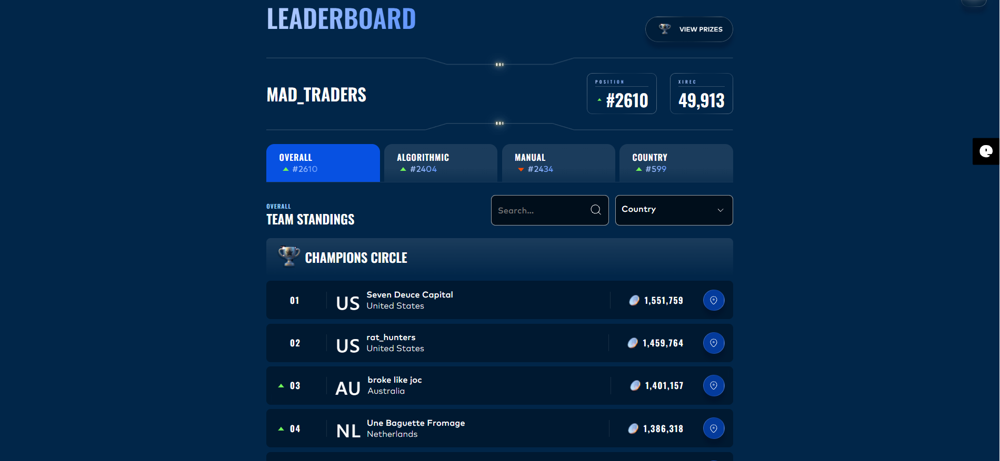
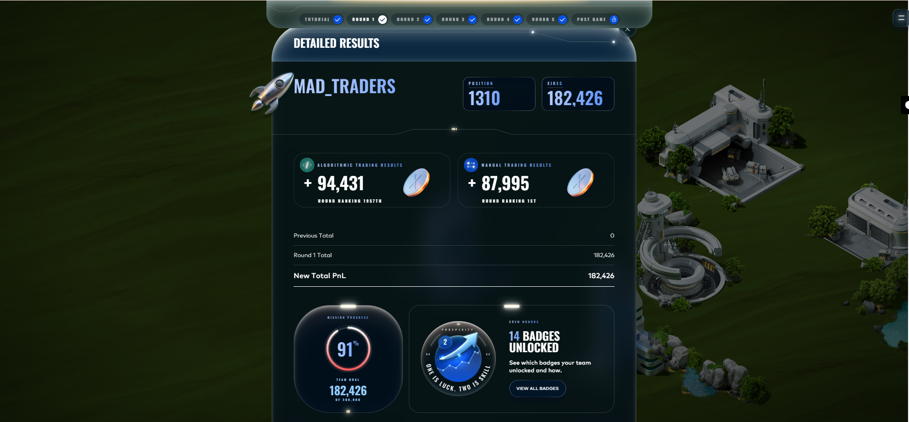
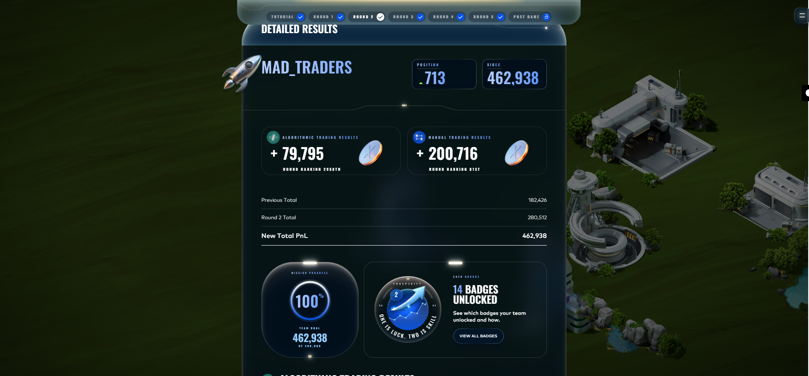
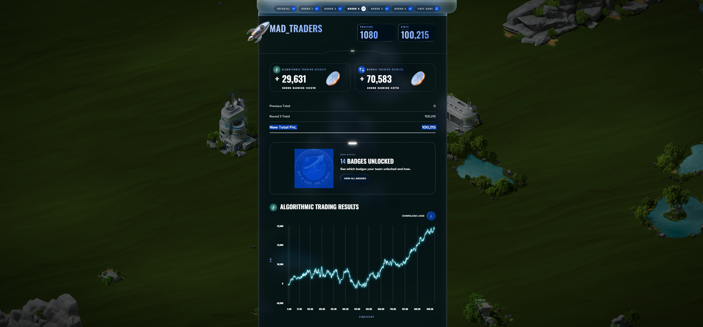
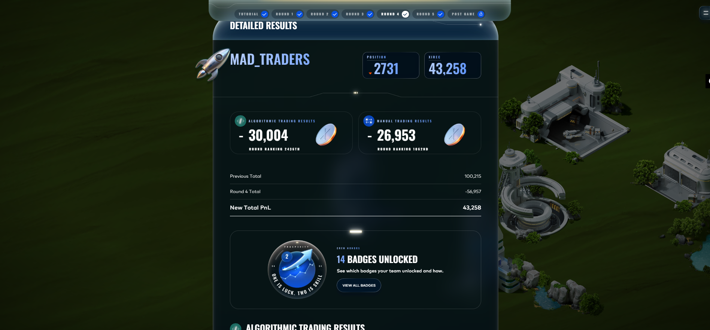
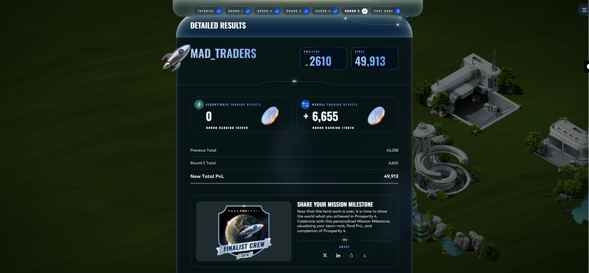

# IMC Prosperity 4 - Mad Traders

Algorithmic trading competition by IMC Trading (2026).
**Team:** Mad_Traders | **Language:** Python 3.12 | **Platform:** IMC Prosperity Sandbox

---

## Final Leaderboard & Achievements

We successfully navigated through the rounds, adapting our strategies to the unique mechanics of the IMC Prosperity sandbox.

---

## Repository Structure

To maintain a clean and professional workspace, we have organized our development history into separate git branches. The `main` branch acts as our pristine portfolio, containing only our final submitted algorithms and results.

- **`main` branch:** Holds the `final_after_Results/` folder, containing our successful algorithmic submissions and leaderboard visualizations for all rounds.
- **`round-1` branch:** Isolated workspace containing trials, data, and scripts utilized specifically for Round 1.
- **`round-2` branch:** Isolated workspace for Round 2.
- **`round-3` branch:** Isolated workspace for Round 3.
- **`round-4` branch:** Isolated workspace for Round 4.
- **`round-5` branch:** Isolated workspace for Round 5.

*(Switch branches in GitHub to view the development, backtesting, and trial code for each respective round.)*

---

## Round-by-Round Strategies & Performance

### Round 1
**Strategy:** Market Making & Trend Exploitation
- **ASH_COATED_OSMIUM:** Implemented safe mean-reversion around the 10000 fair value, sweeping mispriced orders and managing inventory skew.
- **INTARIAN_PEPPER_ROOT:** Abused the strictly linear drifting trend (+1000/day) by aggressively taking and holding a maximum long position.

### Round 2
**Strategy:** Limited Market Access & Optimization
- Optimized execution speed to run within the 900ms per tick restriction.
- Implemented a calculated Market Access Fee (MAF) bid to guarantee access to the top 50% participant tier, securing a 25% extra order volume advantage.

### Round 3
**Strategy:** Options Market-Making (IV Smile Tracking)
- Priced complex multi-leg options on new assets.
- Built a passive and aggressive market-taking protocol that managed edge effectively within position limits.

### Round 4
**Strategy:** Black-Scholes Option Arbitrage & Counterparty Intelligence
- **VEV Options:** Priced 10 VEV call option strikes using a custom Black-Scholes model. Swept all mispriced orders from the book and placed full position-limit passive quotes at +/-1 tick from theoretical fair value.
- **Counterparty Fade:** Analyzed historical trade tapes to classify counterparty behavior. Specifically identified and faded "Mark 38" (a consistently poor-performing bot) on HYDROGEL_PACK.

### Round 5
**Status:** Grand Finals
- Culmination of refined Black-Scholes pricing and persistent state (EMA) tracking across the simulated trading environment.

---

## Technical Highlights

| Algorithm | Application | Implementation |
|-----------|------------|----------------|
| Black-Scholes pricing | VEV option fair value | math.erf() CDF, no scipy |
| EMA tracking | HP/VF fair value estimation | alpha=0.08, persistent state |
| Order book sweep | Aggressive mispricing capture | Multi-level ask/bid sweep |
| Counterparty fading | HP market-making edge | Mark 38 trade tape analysis |
| Inventory skew | Risk management | Position-proportional quote bias |

### Design Decisions
- **No external libraries:** Pure Python (math, json, jsonpickle). No numpy or scipy.
- **State persistence:** EMA values and day counters serialized via `jsonpickle`.
- **Position management:** Full limit utilization with inventory skew for risk control.
- **Execution budget:** Highly optimized native data structures.

---

## Acknowledgements & Credits
- **Backtester & Logging:** Huge thanks to **Kevin** (`kevin-fu1`) for the logging integrations and visualizer tools that significantly aided our offline testing and strategy tuning.
- **Offline Engine:** Also acknowledging the foundational open-source backtester work by **jmerle** which heavily inspired our offline testing setup.
